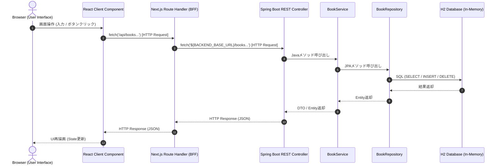

# 簡易図書管理アプリ (Library Management Sample Application)

本アプリケーションは、**React / Next.js (App Router, BFF) / Spring Boot / H2 Database / Docker / Azure App Service** までを一気通貫で理解するための学習用サンプルアプリケーションです。

初心者の方がコードを読んだ際に、処理の流れ（Browser → React → Next.js BFF → Spring Boot → Database）を極めて容易に追跡できるように設計されています。

---

## 1. Architecture

全体の通信経路および層構造は以下の通りです。



---

## 2. Directory Structure

全体のフォルダ構造と、主要ファイルの役割は以下の通りです。

```
LibraryManagement/
├── frontend/                 # Next.js / React フロントエンド & BFF
│   ├── app/
│   │   ├── api/books/
│   │   │   ├── route.ts      # [BFF] 一覧取得(GET) / 新規登録(POST) の中継ルーティング
│   │   │   └── [id]/
│   │   │       └── route.ts  # [BFF] 詳細取得(GET) / 削除(DELETE) の中継ルーティング
│   │   ├── books/
│   │   │   ├── page.tsx      # [React] 書籍一覧画面 (画面表示・操作の受託)
│   │   │   ├── new/
│   │   │   │   └── page.tsx  # [React] 書籍登録画面
│   │   │   └── [id]/
│   │   │       └── page.tsx  # [React] 書籍詳細画面・削除ボタン
│   │   ├── globals.css       # Vanilla CSS (ライブラリ非依存の最小限スタイル)
│   │   ├── layout.tsx        # アプリ共通レイアウト
│   │   └── page.tsx          # ルート(/)アクセス時のリダイレクト処理
│   ├── package.json
│   ├── tsconfig.json
│   ├── next.config.mjs       # Next.js設定 (standalone出力設定)
│   └── Dockerfile            # フロントエンドコンテナ作成用
├── backend/                  # Spring Boot バックエンド REST API
│   ├── src/main/java/com/example/library/
│   │   ├── controller/
│   │   │   └── BookController.java    # REST APIコントローラー (HTTPリクエスト受付・バリデーション)
│   │   ├── service/
│   │   │   └── BookService.java       # 業務ロジック・トランザクション制御
│   │   ├── repository/
│   │   │   └── BookRepository.java    # JPA Repository (DB操作抽象化)
│   │   ├── entity/
│   │   │   └── Book.java              # DBテーブルと対になる Entity
│   │   ├── dto/
│   │   │   └── BookRequest.java       # リクエスト用入力バリデーション DTO
│   │   ├── config/
│   │   │   └── DataInitializer.java   # 起動時サンプルデータ投入
│   │   └── LibraryApplication.java    # エントリーポイント
│   ├── src/main/resources/
│   │   └── application.yml            # H2 DB・ポート設定
│   ├── build.gradle                   # Gradleビルド定義
│   └── Dockerfile                     # バックエンドコンテナ作成用
├── docs/
│   └── architecture.md       # アーキテクチャ詳細解説
├── compose.yaml              # Local Docker Compose定義
└── README.md                 # 本ドキュメント
```

### 主要ファイルの責務まとめ
- **`page.tsx`**: ユーザーが操作するUI画面コンポーネント (React)。ブラウザ側で実行され、BFF (`/api/...`) へ `fetch` を送出します。
- **`route.ts`**: Next.js App RouterのRoute Handler (BFF)。ブラウザからのリクエストを受信し、Spring Boot API へ仲介・プロキシします。
- **`BookController.java`**: Spring BootのREST APIコントローラー。HTTPリクエストのパス・メソッドを判定し、@Validで入力チェックを行った上でServiceを呼び出します。
- **`BookService.java`**: 業務処理を担当する領域。Entityの組み立てやリポジトリの呼び出し、トランザクション制御を行います。
- **`BookRepository.java`**: Spring Data JPAを利用したデータアクセス層。H2データベースに対するSQL発行とオブジェクトマッピングを行います。
- **`Book.java`**: データベースの `books` テーブルと1対1でマッピングされるEntityクラスです。

---

## 3. Local Development (Dockerを使用しない場合)

Dockerを使わずにローカル環境で起動する手順です。Terminalを2つ開いて実行してください。

### Prerequisites
- Java 21
- Node.js (v18+)

### Step 1: Spring Boot の起動 (Terminal 1)
```bash
cd backend
./gradlew bootRun
```
*バックエンドAPIが `http://localhost:8080` で起動します。*

### Step 2: Next.js の起動 (Terminal 2)
```bash
cd frontend
npm install
npm run dev
```
*フロントエンドおよびBFFが `http://localhost:3000` で起動します。*

### ブラウザアクセス
ブラウザで以下のURLを開いて操作してください。  
**URL:** [http://localhost:3000/books](http://localhost:3000/books)

---

## 4. Local Docker (Docker Composeを使用する場合)

Docker環境でコンテナとして一括起動する手順です。

```bash
# イメージのビルドとコンテナ起動
docker compose build
docker compose up
```

起動後、ブラウザでアクセスしてください。  
**URL:** [http://localhost:3000/books](http://localhost:3000/books)

*停止する場合:*
```bash
docker compose down
```

---

## 5. Request Flow (ファイル名による処理追跡ロードマップ)

各画面操作を行ったときに、どのファイルのどの処理を通るかを実際のファイル名で追跡します。

### パターン 1: 書籍一覧取得

1. **`frontend/app/books/page.tsx`**  
   コンポーネント読み込み時に `useEffect` 内で `fetch('/api/books')` を実行。
2. **`frontend/app/api/books/route.ts`**  
   BFFの `GET()` 関数が受け取り、`fetch('${BACKEND_BASE_URL}/books')` で Spring Boot へ仲介。
3. **`backend/src/main/java/com/example/library/controller/BookController.java`**  
   `getAllBooks()` メソッド (`@GetMapping`) が受け取り、`bookService.findAll()` を呼び出す。
4. **`backend/src/main/java/com/example/library/service/BookService.java`**  
   `findAll()` が呼び出され、`bookRepository.findAll()` を実行。
5. **`backend/src/main/java/com/example/library/repository/BookRepository.java`**  
   Spring Data JPA が `SELECT * FROM books` を実行。
6. **`backend/src/main/java/com/example/library/entity/Book.java`**  
   H2 DBから取得したレコードが `Book` Entityオブジェクトにマッピングされ、JSON化されてBFFへ返却。
7. **`frontend/app/books/page.tsx`**  
   JSONデータを受け取り `setBooks(data)` で state を更新。Reactが画面に書籍一覧を再描画。

---

### パターン 2: 書籍新規登録

1. **`frontend/app/books/new/page.tsx`**  
   ユーザーがフォームに `title` と `author` を入力し「登録」ボタンをクリック。`handleSubmit` 内で `fetch('/api/books', { method: 'POST', body: JSON.stringify({ title, author }) })` を送信。
2. **`frontend/app/api/books/route.ts`**  
   BFFの `POST(request)` 関数が受け取り、リクエストボディを抽出して `fetch('${BACKEND_BASE_URL}/books', { method: 'POST', body: ... })` を実行。
3. **`backend/src/main/java/com/example/library/controller/BookController.java`**  
   `createBook()` メソッド (`@PostMapping`) が受け取り、`@Valid` で `BookRequest` の入力チェック（空チェック等）を実施。エラーがなければ `bookService.create(request)` を呼び出す。
4. **`backend/src/main/java/com/example/library/service/BookService.java`**  
   `create()` メソッドで新しい `Book` Entityを組み立て、`bookRepository.save(book)` を呼び出す。
5. **`backend/src/main/java/com/example/library/repository/BookRepository.java`**  
   `INSERT INTO books (title, author) VALUES (...)` を H2 データベースへ発行。
6. **登録完了後**  
   Spring Boot (201 Created) → BFF (201 Created) → `frontend/app/books/new/page.tsx` へレスポンス返却。  
   React側で `router.push('/books')` を実行し、`/books` (一覧画面) へ戻る。

---

### パターン 3: 書籍削除

1. **`frontend/app/books/[id]/page.tsx`**  
   ユーザーが詳細画面で「削除」ボタンをクリック。`handleDelete` 内で `fetch('/api/books/' + id, { method: 'DELETE' })` を送信。
2. **`frontend/app/api/books/[id]/route.ts`**  
   BFFの `DELETE(request, { params })` 関数が受け取り、`fetch('${BACKEND_BASE_URL}/books/' + id, { method: 'DELETE' })` を送信。
3. **`backend/src/main/java/com/example/library/controller/BookController.java`**  
   `deleteBook(@PathVariable Long id)` メソッド (`@DeleteMapping("/{id}")`) が受け取り、`bookService.deleteById(id)` を呼び出す。
4. **`backend/src/main/java/com/example/library/service/BookService.java`**  
   `deleteById()` メソッドが指定されたIDの存在を確認し、`bookRepository.deleteById(id)` を呼び出す。
5. **`backend/src/main/java/com/example/library/repository/BookRepository.java`**  
   `DELETE FROM books WHERE id = ?` を H2 データベースへ発行。
6. **削除完了後**  
   Spring Boot (204 No Content) → BFF (204 No Content) → `frontend/app/books/[id]/page.tsx` へレスポンス返却。  
   React側で `router.push('/books')` を実行し、`/books` (一覧画面) へ戻る。
